# iReadme System Topology & Visual Architecture (`docs/architecture/system_topology.md`)

## 1. Visual Topology Diagram

```mermaid
flowchart LR
    subgraph INGESTION["Multi-AI Ingestion Plane"]
        direction TB
        A1["Google Antigravity / Gemini"]
        A2["Anthropic Claude Code"]
        A3["OpenAI ChatGPT / Codex"]
        A4["Cursor IDE & GitHub Copilot"]
    end

    subgraph GOVERNANCE["Governance & Invariant Plane"]
        direction TB
        G1["GEMINI.md"]
        G2["AGENTS.md"]
        G3["CLAUDE.md"]
        G4[".cursorrules"]
    end

    subgraph KERNEL["Core Analytical Kernel"]
        direction TB
        K1["KaTeX / LaTeX Parser"]
        K2["Path Portability Guard"]
        K3["Safe Atomic Writer"]
    end

    subgraph OUTPUT["Dual Synchronization Output"]
        direction TB
        O1["README.md (English Master)"]
        O2["README_ES.md (Spanish Twin)"]
    end

    subgraph VERIFY["Verification & Regression Suite"]
        direction TB
        V1["Pytest Invariants"]
        V2["Golden Snapshots"]
    end

    INGESTION --> GOVERNANCE
    GOVERNANCE --> KERNEL
    KERNEL --> OUTPUT
    OUTPUT --> VERIFY
```

## 2. Layer Description
- **Multi-AI Ingestion Plane:** Provides native rules and seamless entry points for all major autonomous AI coding agents.
- **Governance & Invariant Plane:** Enforces the Enterprise Paper-Grade v2.0 invariants (zero emojis, zero absolute paths, canonical 8-section layout).
- **Core Analytical Kernel:** Orchestrates atomic writes, KaTeX balance validations, and relative path conversions.
- **Dual Synchronization Output:** Produces synchronized English and Spanish documentation artifacts.
- **Verification Suite:** Continuous invariant testing ensuring reproducibility and zero regression.
